# 业务流程详细分析

> 基于 [design/后台设计.md](后台设计.md)、[requirements/后台需求.md](../requirements/后台需求.md) 与 [requirements/需求.md](../requirements/需求.md) 整理。
>
> **实现状态说明（2026-07 核对代码后更新）**：本文档原为阶段规划文档，现已按当前代码核对修订。
> 文中标注「（规划中，未实现）」的内容表示代码中尚未落地，其余描述以当前实现为准。主要差异：
> - Jenkins 模块已整体下线，打包统一由 `apps.package`（Docker 镜像 / 本地脚本 / SVN 推送）承担；
> - 发布状态机简化为 `draft / pending / released / rejected`，旧的 `building / auditing` 状态已废弃；
> - `ProjectIntegration`（项目外站绑定）设计未落地，代码仓库直接归属项目并各自绑定凭证；
> - 后端暂无 AI 调用模块（规划中），AI 能力目前由 vscode-commit VS Code 插件承担；
> - 已新增站内通知（`apps.notification`）与使用反馈（`apps.feedback`）模块。

---

## 一、系统定位与总体业务目标

本系统是一个 **软件版本发布管理系统（Trace Ship）**，核心目标是实现：

- **项目接入**：多项目隔离管理，支持 GitLab 代码仓库接入（已实现；Gitea/SVN 仓库接入为规划中，未实现——SVN 仅作为打包产物推送目标）。
- **提交规范审查**：自动校验 commit 格式，识别非法提交并预警（已实现，基于规则引擎）。
- **版本生成与发布**：基于目标分支到上一个 tag 的差异自动生成发布说明，自动计算版本号，审批通过后推 tag（已实现）。
- **系统内置打包**：发布成功后自动（或手动）触发打包，支持 Docker 镜像打包、本地脚本打包与产物 SVN 推送（已实现，走 `apps.package`；原规划的 Jenkins 自动打包已废弃，Jenkins 模块已下线）。
- **工作流审批**：自定义审批流程，支持通过、驳回、转交、回退、撤销，串行节点支持或签/会签（已实现）。
- **发布看板**：发布记录检索、统计、发布目录（已实现）；导出 Markdown / PDF / Word（已实现）。
- **站内通知与使用反馈**：审批/构建/发布/系统通知（已实现）；使用反馈提交、点赞与处理状态流转（已实现）。

---

## 二、核心业务实体关系

```text
User (1) ───< UserRole >─── (N) Role
User (1) ─── (N) Credential
Project (1) ───< ProjectMember >─── (N) User
Project (1) ─── (N) Repository           # 仓库直接归属项目并各自绑定凭证
Project (1) ─── (N) WorkflowDefinition
Project (1) ─── (N) ReleaseRecord
Project (1) ─── (N) PackageConfig
Repository (1) ─── (N) RepositoryBranch
Repository (1) ─── (N) CommitRecord
ReleaseRecord (1) ─── (N) ReleaseCommit
ReleaseRecord (1) ─── (N) ReleaseMergeRequest
ReleaseRecord (1) ─── (N) PackageTask
ReleaseRecord (N) ─── (1) WorkflowInstance
WorkflowDefinition (1) ─── (N) WorkflowInstance
WorkflowInstance (1) ─── (N) WorkflowTask
PackageImage (1) ─── (N) PackageConfig
PackageConfig (1) ─── (N) PackageTask
User (1) ─── (N) Notification
User (1) ─── (N) Feedback
```

> 说明：原规划中的 `ProjectIntegration`（项目外站绑定）未落地（规划中，未实现，且设计已废弃）；
> Jenkins 相关实体（jenkins_job / jenkins_build）已随模块下线删除。

---

## 三、主要业务流程

### 3.1 用户认证与权限管理流程（已实现）

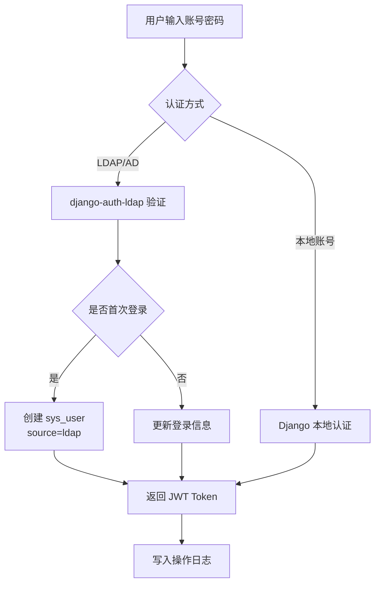

> LDAP 连接参数支持「系统配置」页面维护（`sys_config` 的 `ldap_*` 键，含启用开关与 TLS 证书配置），
> 页面配置优先、环境变量 `LDAP_*` 兜底，并提供 LDAP 连接测试接口（已实现）。
> 默认管理员 `admin / admin@123`，密码丢失可用 `python manage.py reset_admin_password` 恢复（已实现）。

**权限校验三级模型：**

| 层级 | 说明 |
|-----|------|
| 超级管理员 | 全部数据与功能权限 |
| 项目内角色 | `developer/tester/manager/auditor/viewer`，通过 `ProjectMember.role` 控制 |
| 功能权限 | Django 内置权限 + 自定义 Permission 类，控制菜单/按钮/API |

---

### 3.2 项目管理流程（已实现）

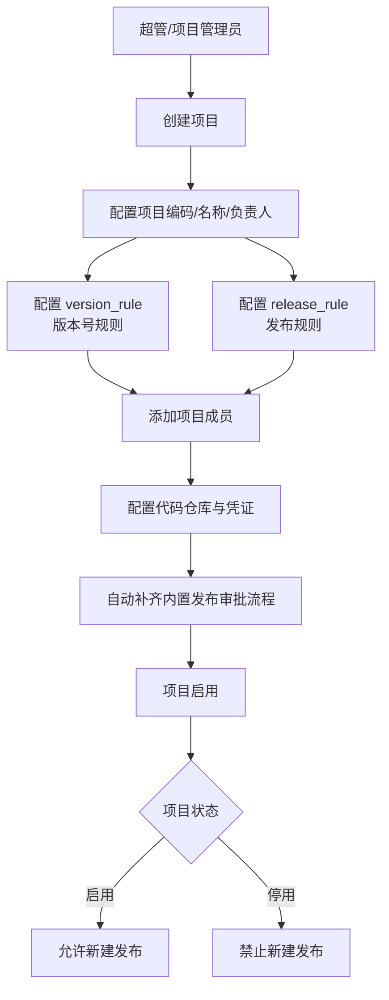

---

### 3.3 凭证管理流程（已实现）

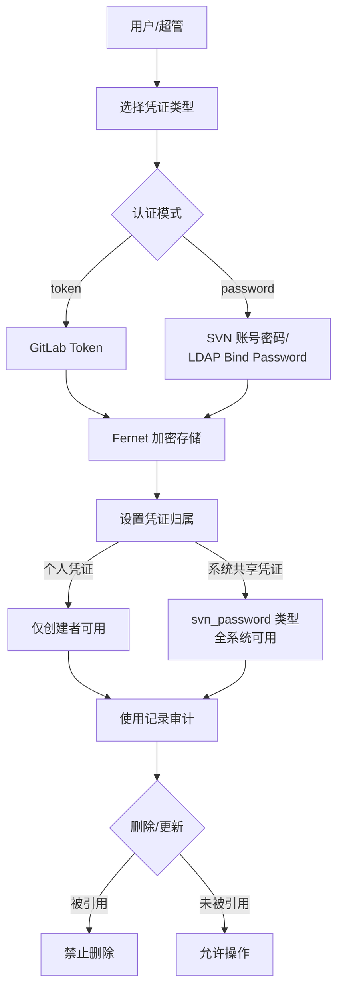

> 说明：原规划的项目凭证 / 全局凭证三级作用范围未完全落地；当前凭证归属用户（owner），
> 仓库上通过 `credential_mode=personal/project` 选择凭证来源，
> `svn_password` 类型为全系统共享凭证（规划中其余范围模型，未实现）。

---

### 3.4 项目外站绑定流程（规划中，未实现，设计已废弃）

> 原设计通过 `sys_project_integration` 统一绑定 Git/SVN/Jenkins 外站，并支持
> `current_user / specified_user / fixed / global` 四种凭证使用模式。
> 该设计未落地且已废弃：当前代码仓库直接归属项目并各自绑定凭证（personal/project 两种来源），
> SVN 仅作为打包产物推送目标，Jenkins 集成已整体下线。以下流程图仅为历史规划存档。

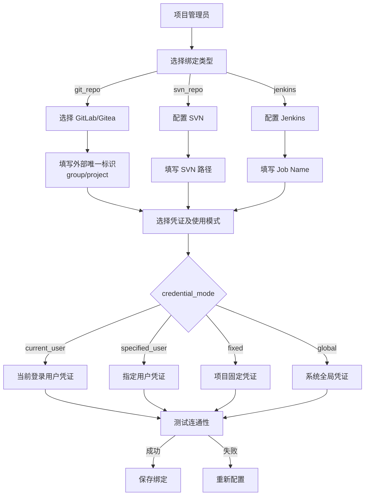

---

### 3.5 代码仓库接入与 Commit 审查流程（已实现）

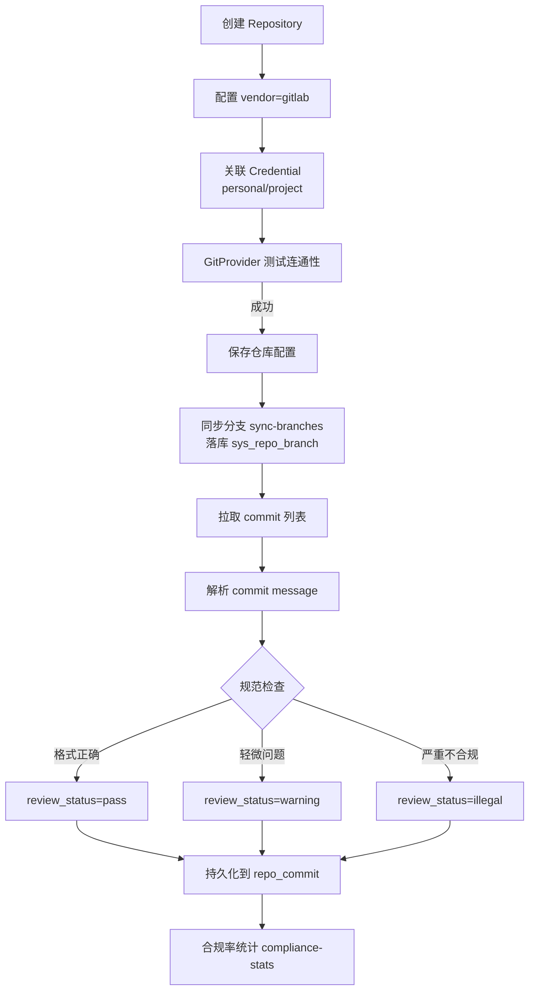

> 说明：
> - 当前仅支持 GitLab 代码仓库（已实现）；Gitea/SVN 仓库接入（规划中，未实现）。
> - 「AI 辅助审查」为规划中能力，后端未实现；AI 生成规范 commit 信息由 vscode-commit 插件承担。

**Commit 规范要求：**

```text
变更类型：
□ 无配置项改动 □有配置项改动

更新内容：
[A为功能增加 F为BUG修复]：
1. A xxx
2. F xxx

配置项改动[详见相关软件配置文件管理]：
[System]
DeviceType=0

关联性改动[选填]：
PXX板卡硬件版本:
...
```

---

### 3.6 TAG 生成与发布流程（已实现，以当前代码为准）

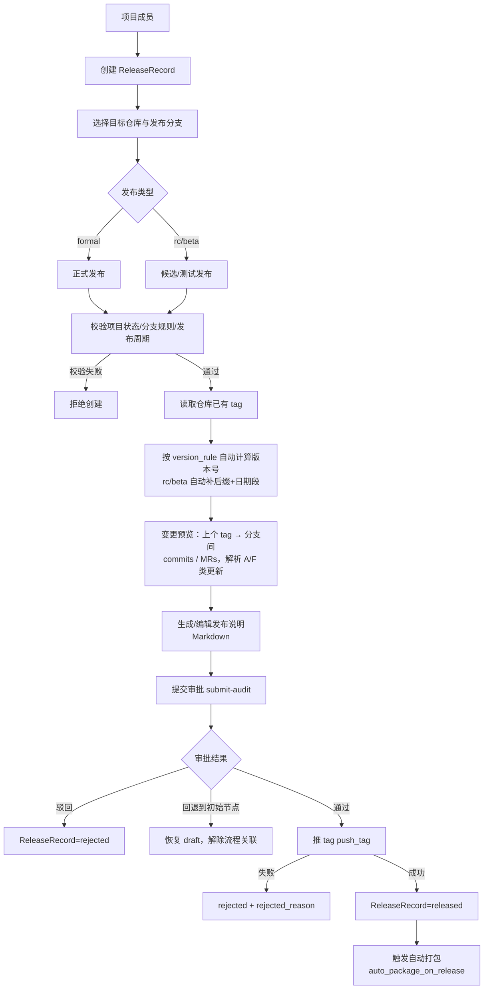

**发布校验规则（以代码为准）：**

| 规则 | 说明 | 状态 |
|-----|------|------|
| 发布类型 | `formal` / `rc` / `beta`（取代旧 formal/test） | 已实现 |
| 分支与 tag 后缀规则 | 由项目 `release_rule` / `version_rule` 控制 | 已实现 |
| 正式发布周期 | `validate_release_cycle` 按 `release_rule` 校验发布周期 | 已实现 |
| 提交审批前置 | 发布须处于 `draft` 且发布说明非空 | 已实现 |
| 打包与发布解耦 | 推 tag 成功后触发自动打包；打包失败不影响发布状态 | 已实现 |

> 说明：原规划中“审批通过 → 触发 Jenkins 构建 → 构建成功才推 tag、构建失败阻断发布”的
> 强耦合流程已废弃；当前为“审批通过 → 推 tag → 自动触发打包”，打包结果与发布状态解耦。

---

### 3.7 打包流程（已实现，apps.package；原 Jenkins 方案已废弃）

```mermaid
flowchart TD
    A[项目管理员] --> B[选择打包镜像]
    B -->|本地| C[本地 Docker 镜像<br/>支持 tar 导入 docker load]
    B -->|Nexus| D[Nexus 镜像<br/>nexus_* 系统配置]
    C --> E[保存 PackageConfig]
    D --> E
    E --> F[配置构建/产物目录<br/>环境变量/自定义脚本]
    F --> G[可选：SVN 推送配置<br/>auto_package_on_release]
    G --> H{触发方式}
    H -->|手动| I[configs/{id}/trigger]
    H -->|发布后自动| J[trigger_auto_packages_for_release]
    I --> K[创建 PackageTask queued]
    J --> K
    K --> L[Celery 异步执行]
    L --> M[准备 workspace<br/>source/artifacts/tmp]
    M --> N[git clone 源码]
    N --> O[启动容器 --entrypoint /bin/sh<br/>挂载 /workspace 三目录]
    O --> P{脚本来源}
    P -->|custom_script| Q[sh -ec 执行自定义脚本（遇错即停）]
    P -->|默认| R[执行镜像内置 script_entry<br/>/workspace/scripts/pack.sh]
    Q --> S[扫描 workspace/artifacts 产物]
    R --> S
    S --> T{SVN 推送?}
    T -->|是| U[推送产物到 SVN<br/>记录推送结果]
    T -->|否| V[任务 success]
    U --> V
    O -->|失败| W[任务 failure<br/>记录 error_message]
```

> 说明：原“Jenkins 自动打包流程”（build_job + Celery 轮询构建状态）为规划中方案，未实现且已废弃；
> Jenkins 模块已整体下线（仅保留迁移 tombstone）。打包任务状态为
> `queued / running / success / failure / canceled`，支持取消、查看日志、下载产物、事后手动 push-svn。

---

### 3.8 工作流审批流程（已实现）

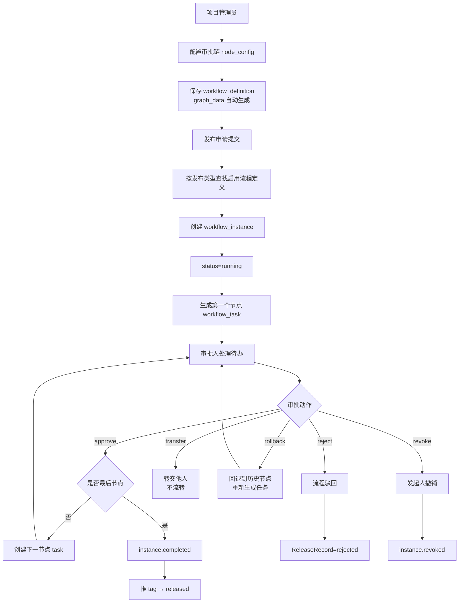

**审批模式与节点配置（以代码为准）：**

| 配置项 | 说明 |
|-------|------|
| mode=any（或签） | 任一审批人通过即流转 |
| mode=all（会签） | 全部审批人通过才流转 |
| 审批人类型 | leader（项目负责人）/ role（项目角色）/ user（指定用户）/ self（发起人） |
| 串行审批 | 审批链按 node_config 顺序逐节点流转 |
| 回退 | rollback 回退到历史节点；回退到初始节点时发布可恢复 draft |

> 说明：原规划中的 start/approval/cc/condition/end 节点类型与 LogicFlow 手工绘图未完全落地；
> 当前为 node_config 审批链 + 自动生成只读流程图，抄送节点、条件分支（规划中，未实现）。

---

### 3.9 发布看板与检索流程（已实现）

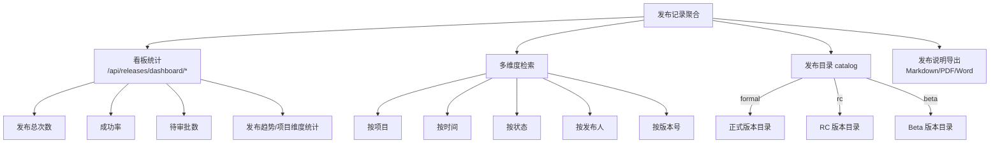

---

## 四、关键外部系统集成流程

### 4.1 LDAP/AD 集成

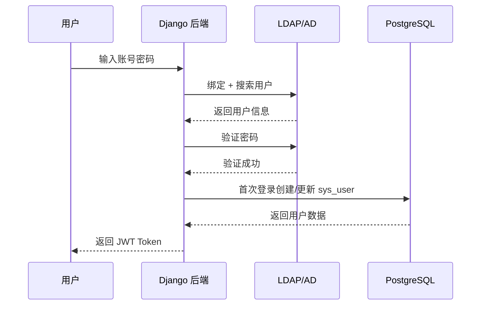

### 4.2 Git 平台集成（已实现，当前仅 GitLab）

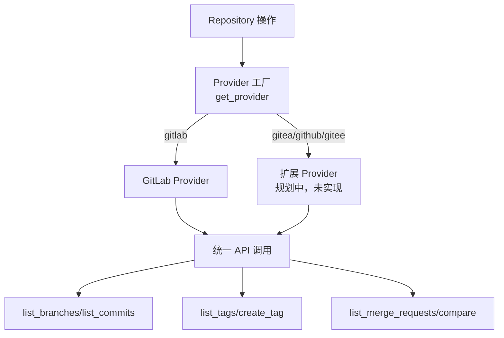

### 4.3 打包运行环境集成（已实现，替代原 Jenkins 方案）

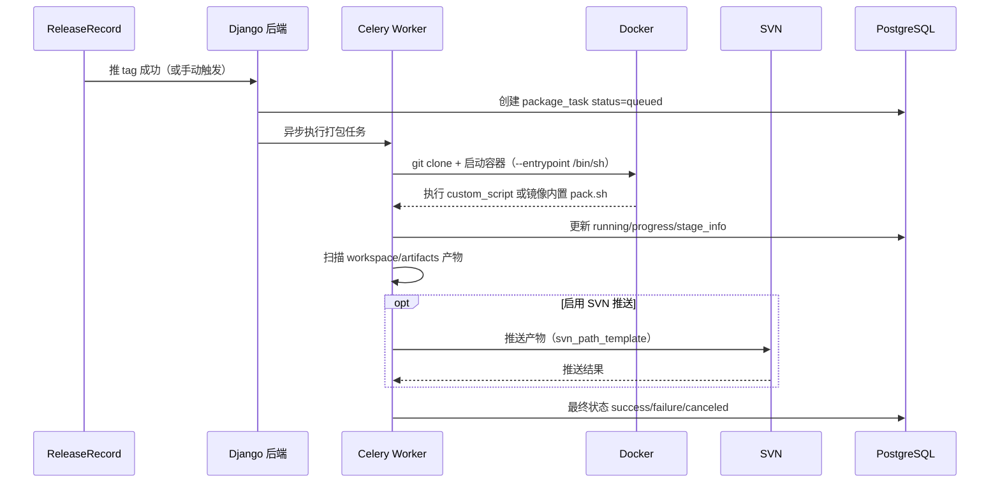

> Nexus 镜像源通过 `sys_config` 的 `nexus_base_url / nexus_username / nexus_password / nexus_registry_host`
> 配置（页面优先，环境变量兜底）；本地镜像支持 tar 包导入。
> 原 Jenkins 集成（build_job + 状态轮询）为规划中方案，未实现且已废弃。

### 4.4 AI 服务集成（规划中，后端未实现）

> 后端暂无 AI 调用模块与 `ai_invoke_log` 表；commit 规范审查基于规则引擎。
> 当前 AI 能力由 `vscode-commit/` VS Code 规范提交助手插件承担：默认本地 DeepSeek 接口，
> `commit.apiProtocol` 配置（auto / openai / anthropic）兼容 OpenAI / Anthropic 等更多 AI 服务。
> 后端 AI 场景（commit 日志生成、发布说明生成、风险识别、统一 AI Client 与调用日志）均为规划中，未实现。

---

## 五、核心状态机

### 5.1 发布记录状态机（已实现，以代码为准）

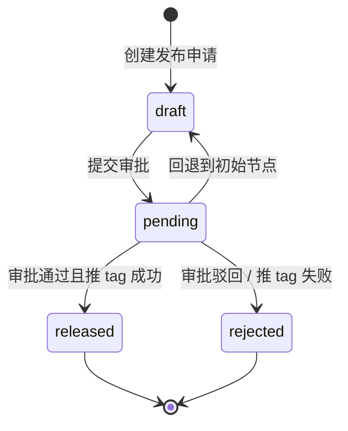

> 旧的 `building / auditing` 状态已废弃：打包与发布状态解耦，
> 推 tag 成功后触发自动打包，打包结果由 `package_task` 独立跟踪。

### 5.2 审批任务状态机（已实现）

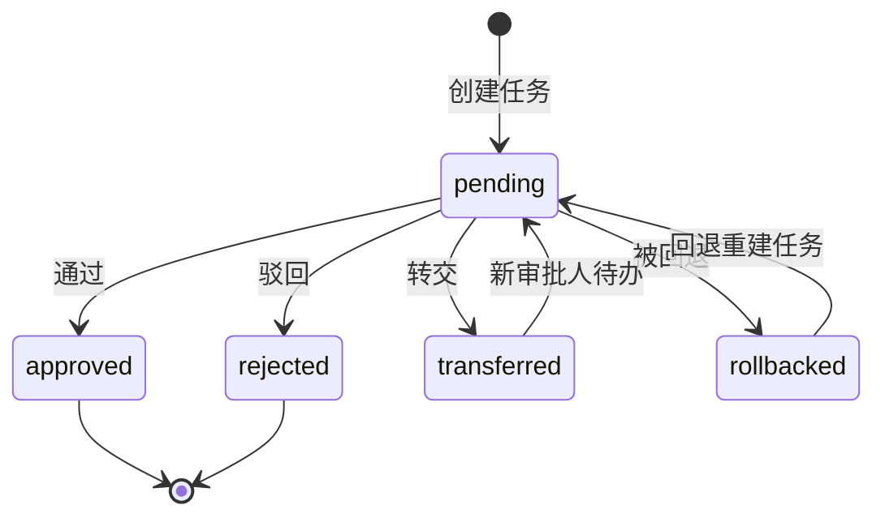

### 5.3 打包任务状态机（已实现，替代原 Jenkins 构建状态机）

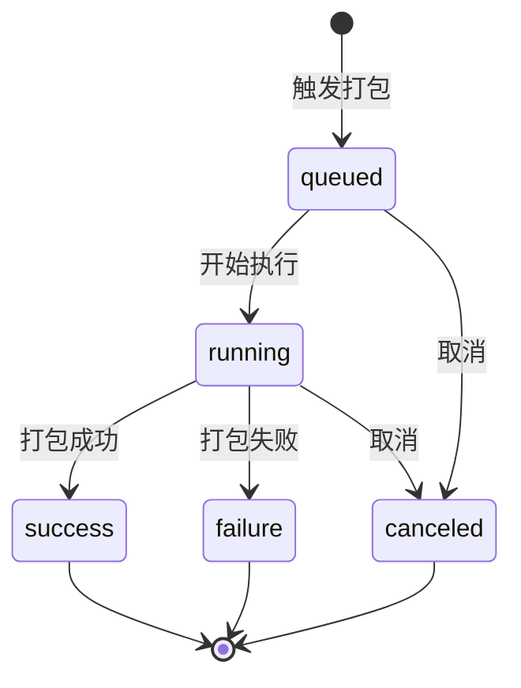

### 5.4 Commit 审查状态机（已实现）

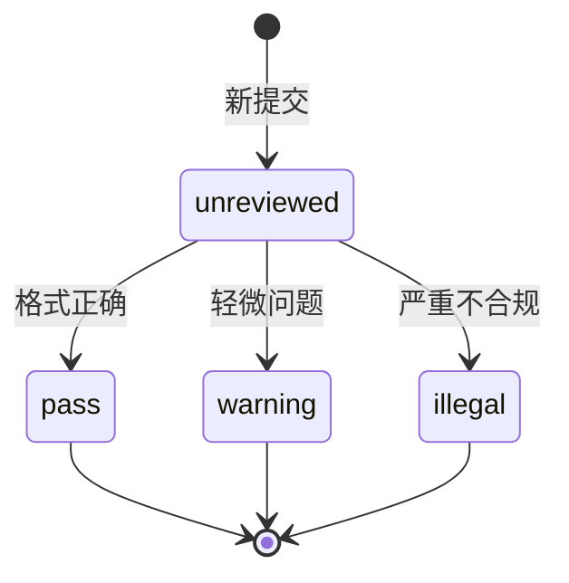

---

## 六、关键业务规则汇总

| 规则编号 | 规则内容 | 状态 |
|---------|---------|------|
| R-001 | 发布分支规则由项目 `release_rule` 控制（发布类型 formal/rc/beta） | 已实现 |
| R-002 | rc/beta 版本自动补 tag 后缀并统一拼接日期段 | 已实现 |
| R-003 | 正式发布需满足发布周期规则（`validate_release_cycle`，周期值由 release_rule 配置） | 已实现 |
| R-004 | 测试版本不允许放入正式发布目录（发布目录按 formal/rc/beta 分类） | 已实现 |
| R-005 | ~~Jenkins 构建失败阻断后续发布步骤~~ 打包与发布解耦，打包失败不影响发布状态（原规则已废弃） | 已变更 |
| R-006 | ~~推 tag 前必须完成审批流且构建成功~~ 推 tag 前必须完成审批流（无构建前置） | 已变更 |
| R-007 | 项目停用后禁止新增发布 | 已实现 |
| R-008 | 凭证删除前必须校验是否被引用 | 已实现 |
| R-009 | 所有外部凭证必须加密存储，禁止明文落库 | 已实现 |
| R-010 | 项目数据严格按项目隔离 | 已实现 |
| R-011 | 超管拥有全部数据与功能权限 | 已实现 |
| R-012 | 操作日志必须记录登录、登出、关键业务操作 | 已实现 |
| R-013 | 反馈删除仅限本人或超管；仅超管可标记反馈为已处理 | 已实现 |

---

## 七、API 与数据流总览

主要接口清单（详见 [docs/后台设计.md 6.2 节](./后台设计.md)）：

- `/api/auth/*`：认证（登录/刷新/登出/用户信息/菜单）
- `/api/account/*`：用户/角色/权限
- `/api/projects/*`：项目/成员（外站绑定接口已废弃）
- `/api/credentials/*`：凭证管理（类型/测试/使用记录）
- `/api/repositories/*`：仓库管理（分支同步/合规率统计/变更预览）
- `/api/commits/*`：提交审查
- `/api/releases/*`：发布管理（含 dashboard/* 看板统计、catalog 发布目录、导出）
- `/api/packages/*`：打包（镜像/配置/任务，替代原 `/api/jenkins/*`，已下线）
- `/api/workflow/*`：工作流（通过/驳回/转交/回退/撤销）
- `/api/notifications/*`：站内通知
- `/api/feedback/*`：使用反馈
- `/api/system/*`：系统管理（配置/操作日志/LDAP 连接测试）
- `/api/schema/`、`/swagger/`、`/redoc/`：API 文档
- `/health/`：健康检查（含 db/redis 状态）

> 说明：原独立 `/api/dashboard/*` 未落地，看板统计挂在 `/api/releases/dashboard/*` 下；
> `/api/system/ai-logs/` 未实现（后端无 AI 调用日志）。

---

## 八、分阶段实施计划

### 8.1 总体原则

1. **先基础后业务**：用户、权限、项目、凭证是其他所有功能的底座。
2. **先核心后扩展**：Commit 审查 → TAG 生成 → 审批流 → 推 tag → 自动打包，是主流程。
3. **先 manual 后 automatic**：先让流程能跑通，再加 AI、Webhook、自动轮询等增强。
4. **先单项目后多项目**：先用一个项目把端到端跑通，再完善多项目隔离和看板。

### 8.2 阶段一：基础底座（第 1~2 周）

**目标**：把项目跑起来，能登录、能管理项目和凭证。

| 功能 | 优先级 | 说明 |
|-----|--------|------|
| 工程骨架搭建 | P0 | Django + DRF + PostgreSQL + Redis + Docker Compose |
| 用户认证 | P0 | LDAP/AD 登录、本地应急账号、JWT Token |
| RBAC 权限 | P0 | 角色、权限、项目成员角色控制 |
| 项目管理 | P0 | 项目 CRUD、项目成员管理、项目状态控制 |
| 凭证管理 | P0 | 凭证 CRUD、加密、归属/审计 |
| 系统参数 | P0 | LDAP、Nexus、Redis 等配置（sys_config 页面维护） |

**产出**：后端服务可启动，可登录，可创建项目、成员、凭证。

> 实现状态：**已全部实现**。LDAP 支持页面配置优先 + 连接测试；管理员密码可通过
> `python manage.py reset_admin_password` 恢复。凭证作用范围中的“项目凭证/全局凭证”
> 三级模型未完全落地（当前为 owner 归属 + svn_password 全系统共享）。

### 8.3 阶段二：仓库接入与 Commit 审查（第 3~4 周）

**目标**：能接入仓库，拉取 commit，并按规范审查。

| 功能 | 优先级 | 说明 |
|-----|--------|------|
| GitProvider 适配器 | P0 | GitLab 统一封装，分支/commit/tag/MR 拉取 |
| 分支同步 | P0 | sync-branches 落库，分支列表本地优先 |
| Commit 同步与存储 | P0 | 拉取 commit 存入 repo_commit |
| Commit 规范审查 | P0 | 按既定格式解析，标记 pass/warning/illegal |
| Commit 查询 | P0 | 按项目/分支/提交人/时间筛选，合规率统计 |
| ~~项目外站绑定~~ | - | 规划中，未实现，设计已废弃（仓库直接绑定凭证） |
| ~~SVN 仓库接入~~ | - | 规划中，未实现（SVN 仅作打包产物推送目标） |

**产出**：可绑定仓库，能查看 commit 列表，非法提交能被标记。

> 实现状态：**除外站绑定与 SVN 仓库接入外已全部实现**；当前仅支持 GitLab，
> Gitea/GitHub/Gitee 通过 Provider 扩展（规划中，未实现）。

### 8.4 阶段三：发布主流程（第 5~7 周）

**目标**：跑通从发布申请 → 生成发布说明 → 审批 → 推 tag → 自动打包的完整闭环。

| 功能 | 优先级 | 说明 |
|-----|--------|------|
| TAG 生成工具 | P0 | 抓取上个 tag→目标分支的 commits/MRs、合并、生成发布文档 |
| 版本号计算 | P0 | 基于 version_rule 自动递增，rc/beta 自动补后缀+日期段 |
| 发布校验 | P0 | 分支规则、tag 后缀、发布周期（validate_release_cycle） |
| 发布说明编辑 | P0 | 人工合并/编辑 commits，Markdown 格式 |
| 推 tag | P0 | 调用 Provider create_tag |
| 发布记录管理 | P0 | ReleaseRecord 全生命周期（draft/pending/released/rejected） |
| 打包配置与任务 | P0 | PackageConfig + PackageTask（Docker 镜像/自定义脚本/SVN 推送） |
| 发布后自动打包 | P0 | auto_package_on_release 触发，失败不影响发布状态 |
| ~~Jenkins 任务配置/构建触发~~ | - | 规划中方案，未实现且已废弃（由 apps.package 替代） |

**产出**：一个项目能完成从发布申请到推 tag、自动打包的完整流程。

> 实现状态：**已全部实现**（打包走 apps.package，Jenkins 模块已下线）。

### 8.5 阶段四：审批流、看板与增强（第 8~10 周）

**目标**：加审批控制、看板统计、通知等增强能力。

| 功能 | 优先级 | 说明 |
|-----|--------|------|
| 工作流定义 | P0 | node_config 审批链、审批人解析（leader/role/user/self） |
| 工作流实例/任务 | P0 | 提交审批、通过/驳回/转交/回退/撤销，或签/会签 |
| 发布状态机 | P0 | draft → pending → released/rejected（旧 building/auditing 已废弃） |
| 发布看板 | P0 | 发布次数、成功率、待审批数、趋势（/api/releases/dashboard/*） |
| 发布记录检索 | P0 | 多维度筛选、catalog 发布目录（formal/rc/beta） |
| 操作日志完善 | P0 | 登录、CRUD、审批、发布等全链路审计 |
| 通知服务 | P1 | 站内通知（审批/构建/发布/系统），已实现；邮件通知（规划中，未实现） |
| 发布单导出 | P2 | Markdown/PDF/Word 导出，已实现 |
| 使用反馈 | P1 | 反馈提交/点赞/处理状态流转，已实现 |
| AI 接入 | P1 | 规划中，后端未实现（vscode-commit 插件已实现 AI 生成 commit 信息） |

**产出**：完整具备审批、看板、打包、通知的版本发布管理系统。

### 8.6 关键依赖关系

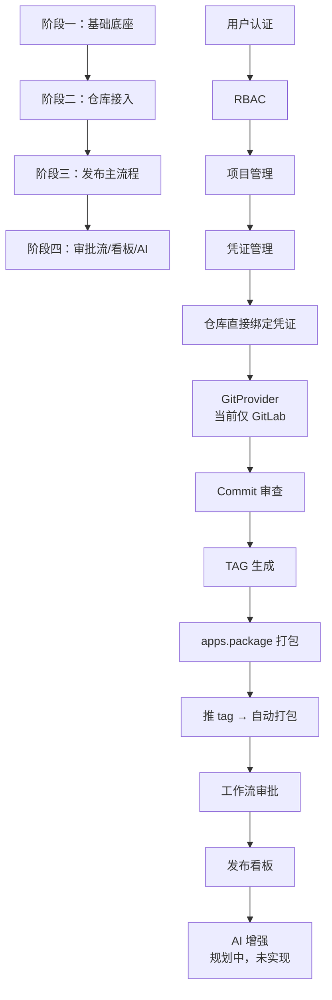

### 8.7 最早可用里程碑

| 里程碑 | 时间点 | 可演示内容 |
|--------|--------|-----------|
| Milestone 1 | 第 2 周末 | 登录、创建项目、添加成员、添加凭证 |
| Milestone 2 | 第 4 周末 | 绑定 Git 仓库、查看 commits、标记非法提交 |
| Milestone 3 | 第 7 周末 | 完成一次端到端发布：申请 → 生成文档 → 审批 → 推 tag → 自动打包 |
| Milestone 4 | 第 10 周末 | 完整系统：审批流、看板、操作日志、站内通知 |

### 8.8 风险与注意事项

1. **凭证加密是全局依赖**：阶段一就必须确定加密方案（Fernet）和密钥管理方式，否则后续所有外站接入都要返工。
2. **GitProvider 抽象要先行**：阶段二先把接口抽象好，后期扩展 Gitea/GitHub/Gitee 才不会影响主流程。
3. **打包镜像规范**：打包依赖镜像内置 `/workspace/scripts/pack.sh` 与 `/workspace` 目录约定，接入新镜像前必须确认满足规范。
4. **工作流与发布状态机强耦合**：审批结果直接驱动 ReleaseRecord 状态流转（通过→推 tag，驳回→rejected，回退初始节点→恢复 draft）。
5. **AI 是增强项且后端未实现**：先把规则引擎的 commit 审查跑稳；AI 能力当前由 vscode-commit 插件承担，后端 AI 接入为规划项。

---

## 九、后端单独开发的里程碑验收标准

### 9.1 总体验收原则

前后端分离开发时，后端每个里程碑的验收应以 **"接口可联调、数据可验证、流程可闭环"** 为核心，不依赖前端页面完成度。

| 验收维度 | 最低要求 |
|---------|---------|
| 接口文档 | 必须提供完整的 Swagger/Redoc 文档 + Postman Collection |
| 接口可用性 | 所有 P0 接口可通过 Postman/curl 调用并返回正确结果 |
| 数据完整性 | 数据库表结构稳定，核心字段非空、索引合理 |
| 权限控制 | 超管/项目角色/功能权限三级校验均通过测试 |
| 日志审计 | 关键操作（登录、CRUD、审批、发布）均有操作日志 |
| 单元测试 | 核心 Service/Utils 单元测试覆盖率 ≥ 60% |
| 集成测试 | 与外部系统（LDAP/Git）的 Mock/真实联调通过 |
| Docker 可运行 | `docker compose` 能一键启动并访问健康检查接口 |

### 9.2 Milestone 1：基础底座验收标准（第 2 周末）

**目标**：后端服务可独立运行，完成认证、权限、项目、凭证管理。

| 验收项 | 验收标准 | 验证方式 |
|--------|---------|---------|
| 工程启动 | `docker-compose up` 成功启动 web/db/redis/celery | 访问 `/health/` 返回 200 |
| 用户登录 | LDAP 用户、本地用户均可登录并返回 JWT | Postman 调用 `/api/auth/login/` |
| RBAC | 不同角色用户访问同一接口返回不同结果 | 超管可访问所有，普通用户受项目隔离 |
| 项目 CRUD | 项目增删改查、成员管理可用 | Postman 完整调用项目接口 |
| 凭证管理 | 凭证增删改查、加密存储、脱敏展示 | 数据库验证 `encrypted_data` 非明文 |
| 接口文档 | Swagger/Redoc 可访问 | 访问 `/swagger/`、`/redoc/` |
| 交付物 | Postman Collection V1、接口说明文档 | 文件提交到 `docs/api/api-spec.md` |

### 9.3 Milestone 2：仓库接入与 Commit 审查验收标准（第 4 周末）

**目标**：后端可接入 Git/SVN 仓库，拉取并审查 commit。

| 验收项 | 验收标准 | 验证方式 |
|--------|---------|---------|
| 仓库配置 | GitLab 仓库配置可用，连通性测试通过 | `/api/repositories/{id}/test/` |
| GitProvider | 同一抽象支持多平台扩展（当前实现 GitLab） | 调用分支/commit/tag 接口 |
| 分支/commit | 可拉取分支列表和 commit 历史，分支可同步落库 | `/api/repositories/{id}/branches/`、`/sync-branches/`、`/commits/` |
| Commit 同步 | 手动同步返回新增条数和非法条数 | `/api/repositories/{id}/sync-commits/` |
| Commit 审查 | 非法提交被正确标记，合规提交为 pass | 数据库检查 `review_status` |
| 合规率统计 | 按项目统计 pass/warning/illegal 数量 | `/api/repositories/compliance-stats/` |
| 权限隔离 | 用户只能查看有权限项目的 commit | 越权访问返回 403 |
| 交付物 | 更新 Postman Collection、Commit 审查规则说明 | 补充到 `docs/` |

### 9.4 Milestone 3：发布主流程验收标准（第 7 周末）

**目标**：后端可独立完成一次从发布申请到推 tag 的完整流程。

| 验收项 | 验收标准 | 验证方式 |
|--------|---------|---------|
| TAG 生成 | 基于上个 tag→目标分支聚合 commits/MRs，生成发布说明草稿 | `/api/releases/{id}/generate-doc/` |
| 版本号计算 | 按项目 version_rule 自动递增，rc/beta 自动补后缀+日期段 | 创建发布后检查 version/tag_name 正确性 |
| 发布校验 | 分支规则、tag 后缀、发布周期校验生效 | Postman 构造异常请求 |
| 提交审批 | draft 且发布说明非空方可提交，生成流程实例 | `/api/releases/{id}/submit-audit/` |
| 推 tag | 审批通过后可在 Git 平台创建 tag | `/api/releases/{id}/push-tag/`，Git 平台验证 tag 存在 |
| 自动打包 | 推 tag 成功触发 auto_package_on_release 的打包任务 | 检查 `package_task` 记录 |
| 打包任务 | 任务状态正确流转（queued/running/success/failure/canceled），日志可查 | `/api/packages/tasks/{id}/logs/` |
| 发布状态机 | ReleaseRecord 状态正确流转（draft/pending/released/rejected） | 数据库检查状态变化 |
| 交付物 | 发布流程测试脚本、打包配置示例 | 提交到 `docker/` 或 `scripts/` |

### 9.5 Milestone 4：审批流、看板与增强验收标准（第 10 周末）

**目标**：后端具备完整审批、看板、AI、审计能力。

| 验收项 | 验收标准 | 验证方式 |
|--------|---------|---------|
| 工作流定义 | 支持 node_config 审批链、或签/会签、审批人类型解析 | 创建并查询流程定义 |
| 审批流转 | 通过/驳回/转交/回退/撤销均正确影响流程实例 | 调用任务审批接口 |
| 发布状态机 | 审批结果正确驱动 ReleaseRecord 状态 | 全流程端到端测试 |
| 看板统计 | 发布次数、成功率、待审批数准确 | `/api/releases/dashboard/overview/` |
| 发布检索 | 多维度筛选、formal/rc/beta 目录分类 | `/api/releases/`、`/api/releases/catalog/` |
| 站内通知 | 审批/构建/发布/系统通知可发送、已读管理 | `/api/notifications/` |
| 使用反馈 | 提交/点赞/删除权限/标记已处理 | `/api/feedback/` |
| 操作日志 | 登录、CRUD、审批、发布全链路可审计 | `/api/system/logs/` |
| AI 接入 | 规划中，后端未实现（vscode-commit 插件已实现 AI 生成 commit 信息） | - |
| 交付物 | 完整接口文档、Postman Collection、部署文档、操作手册 | 提交到 `docs/` 和 `README.md` |

### 9.6 通用交付物清单

每个里程碑后端必须交付：

| 交付物 | 说明 | 位置建议 |
|--------|------|---------|
| 源码 | 对应功能的后端代码 | `backend/` |
| 接口文档 | Swagger/Redoc + Markdown 文档 | `docs/api/api-spec.md` |
| Postman Collection | 可导入直接调用 | `docs/api/postman/` |
| 数据库迁移脚本 | Django migrations | `backend/apps/**/migrations/` |
| Docker 配置 | 可一键启动 | `docker/` |
| 单元测试 | 核心逻辑覆盖 | `backend/apps/**/tests/` |
| 操作日志 | 关键操作审计 | 通过 `/api/system/logs/` 验证 |
| 部署说明 | 环境变量、外部服务配置 | `README.md` 或 `docs/` |

### 9.7 接口联调标准

1. **接口冻结**：每个里程碑结束时，P0 接口的 URL、请求体、响应体字段冻结，后续里程碑只能新增字段，不能删除或改含义。
2. **版本协商**：默认 V1，通过 `Accept` 头协商，前端无需传版本号。
3. **错误码统一**：前端可根据 `code` 做统一错误处理，不再解析 `message` 做判断。
4. **Mock 支持**：前端 mock 目录已彻底清理，页面一律对接真实接口；本地无后端时通过 docker 依赖 + 本地后端联调（原 `/api/mock/*` 规划未实现）。
5. **联调窗口**：每个里程碑结束后预留 1~2 天给前端联调，后端同步修复接口问题。

### 9.8 质量门禁

| 检查项 | 门禁标准 |
|--------|---------|
| 单元测试覆盖率 | ≥ 60%（核心模块 ≥ 80%） |
| Pylint/Flake8 | 无严重错误 |
| 接口响应时间 | P95 ≤ 500ms（不含外部调用） |
| 数据库迁移 | 必须可前向迁移，禁止破坏性变更 |
| 敏感信息 | 凭证、Token 必须加密，日志中无脱敏前内容 |
| 健康检查 | `/health/` 返回 200，包含 db/redis 状态 |
