# 业务流程详细分析

> 基于 [后台设计](后台设计.md) 与[初始需求历史归档](https://github.com/qingxiaoyuan/trace-ship/issues/10)整理。
>
> **使用说明（2026-10-09）**：本文保留长期业务参考，阶段计划与里程碑验收已迁移到 [Issue #10](https://github.com/qingxiaoyuan/trace-ship/issues/10)。以下实现说明是历史核对结果，后续领域调整以代码与 ADR 为准。
>
> **实现状态说明（2026-07 核对代码后更新）**：本文档原为阶段规划文档，现已按当前代码核对修订。
> 文中标注「（规划中，未实现）」的内容表示代码中尚未落地，其余描述以当前实现为准。主要差异：
> - Jenkins 模块已整体下线，打包统一由 `apps.package`（Docker 镜像 / 本地脚本 / SVN 推送）承担；
> - 发布状态机简化为 `draft / pending / released / rejected`，旧的 `building / auditing` 状态已废弃；
> - `ProjectIntegration`（项目外站绑定）设计未落地，代码仓库直接归属项目并各自绑定凭证；
> - 后端暂无 AI 调用模块（规划中），AI 能力目前由 vscode-commit VS Code 插件承担；
> - 已新增站内通知（`apps.notification`）与使用反馈（`apps.feedback`）模块。

---

## 一、系统定位与总体业务目标

本系统是一个 **软件版本发布管理系统（Trace Ship）**，核心目标是实现：

- **项目接入**：多项目隔离管理，支持 GitLab 代码仓库接入（已实现；Gitea/SVN 仓库接入为规划中，未实现——SVN 仅作为打包产物推送目标）。
- **提交规范审查**：自动校验 commit 格式，识别非法提交并预警（已实现，基于规则引擎）。
- **版本生成与发布**：基于目标分支到上一个 tag 的差异自动生成发布说明，自动计算版本号，审批通过后推 tag（已实现）。
- **系统内置打包**：发布成功后自动（或手动）触发打包，支持 Docker 镜像打包、本地脚本打包与产物 SVN 推送（已实现，走 `apps.package`；原规划的 Jenkins 自动打包已废弃，Jenkins 模块已下线）。
- **工作流审批**：自定义审批流程，支持通过、驳回、转交、回退、撤销，串行节点支持或签/会签（已实现）。
- **发布看板**：发布记录检索、统计、发布目录（已实现）；导出 Markdown / PDF / Word（已实现）。
- **站内通知与使用反馈**：审批/构建/发布/系统通知（已实现）；使用反馈提交、点赞与处理状态流转（已实现）。

---

## 二、核心业务实体关系

```text
User (1) ───< UserRole >─── (N) Role
User (1) ─── (N) Credential
Project (1) ───< ProjectMember >─── (N) User
Project (1) ─── (N) Repository           # 仓库直接归属项目并各自绑定凭证
Project (1) ─── (N) WorkflowDefinition
Project (1) ─── (N) ReleaseRecord
Project (1) ─── (N) PackageConfig
Repository (1) ─── (N) RepositoryBranch
Repository (1) ─── (N) CommitRecord
ReleaseRecord (1) ─── (N) ReleaseCommit
ReleaseRecord (1) ─── (N) ReleaseMergeRequest
ReleaseRecord (1) ─── (N) PackageTask
ReleaseRecord (N) ─── (1) WorkflowInstance
WorkflowDefinition (1) ─── (N) WorkflowInstance
WorkflowInstance (1) ─── (N) WorkflowTask
PackageImage (1) ─── (N) PackageConfig
PackageConfig (1) ─── (N) PackageTask
User (1) ─── (N) Notification
User (1) ─── (N) Feedback
```

> 说明：原规划中的 `ProjectIntegration`（项目外站绑定）未落地（规划中，未实现，且设计已废弃）；
> Jenkins 相关实体（jenkins_job / jenkins_build）已随模块下线删除。

---

## 三、主要业务流程

### 3.1 用户认证与权限管理流程（已实现）

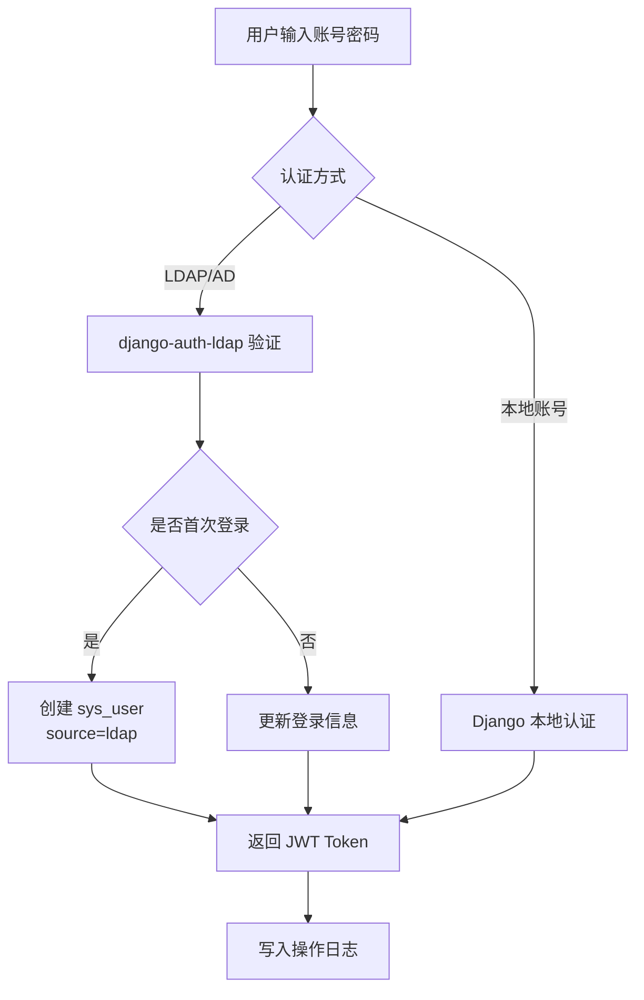
```mermaid
flowchart TD
    A[用户输入账号密码] --> B{认证方式}
    B -->|LDAP/AD| C[django-auth-ldap 验证]
    B -->|本地账号| D[Django 本地认证]
    C --> E{是否首次登录}
    E -->|是| F[创建 sys_user<br/>source=ldap]
    E -->|否| G[更新登录信息]
    F --> H[返回 JWT Token]
    G --> H
    D --> H
    H --> I[写入操作日志]
```

> LDAP 连接参数支持「系统配置」页面维护（`sys_config` 的 `ldap_*` 键，含启用开关与 TLS 证书配置），
> 页面配置优先、环境变量 `LDAP_*` 兜底，并提供 LDAP 连接测试接口（已实现）。
> 默认管理员 `admin / admin@123`，密码丢失可用 `python manage.py reset_admin_password` 恢复（已实现）。

**权限校验三级模型：**

| 层级 | 说明 |
|-----|------|
| 超级管理员 | 全部数据与功能权限 |
| 项目内角色 | `developer/tester/manager/auditor/viewer`，通过 `ProjectMember.role` 控制 |
| 功能权限 | Django 内置权限 + 自定义 Permission 类，控制菜单/按钮/API |

---

### 3.2 项目管理流程（已实现）

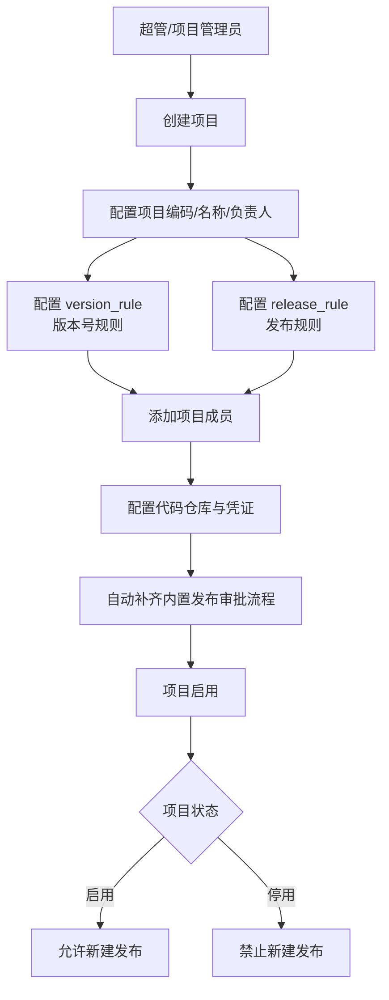
```mermaid
flowchart TD
    A[超管/项目管理员] --> B[创建项目]
    B --> C[配置项目编码/名称/负责人]
    C --> D[配置 version_rule<br/>版本号规则]
    C --> E[配置 release_rule<br/>发布规则]
    D --> F[添加项目成员]
    E --> F
    F --> G[配置代码仓库与凭证]
    G --> H[自动补齐内置发布审批流程]
    H --> I[项目启用]
    I --> J{项目状态}
    J -->|启用| K[允许新建发布]
    J -->|停用| L[禁止新建发布]
```

---

### 3.3 凭证管理流程（已实现）

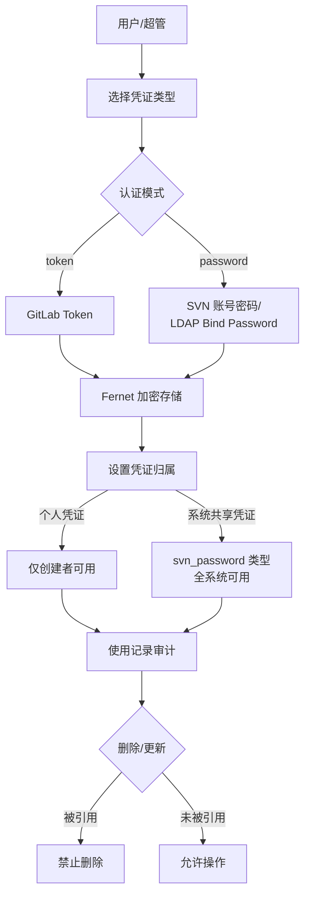
```mermaid
flowchart TD
    A[用户/超管] --> B[选择凭证类型]
    B --> C{认证模式}
    C -->|token| D[GitLab Token]
    C -->|password| E[SVN 账号密码/<br/>LDAP Bind Password]
    D --> F[Fernet 加密存储]
    E --> F
    F --> G[设置凭证归属]
    G -->|个人凭证| H[仅创建者可用]
    G -->|系统共享凭证| I[svn_password 类型<br/>全系统可用]
    H --> K[使用记录审计]
    I --> K
    K --> L{删除/更新}
    L -->|被引用| M[禁止删除]
    L -->|未被引用| N[允许操作]
```

> 说明：原规划的项目凭证 / 全局凭证三级作用范围未完全落地；当前凭证归属用户（owner），
> 仓库上通过 `credential_mode=personal/project` 选择凭证来源，
> `svn_password` 类型为全系统共享凭证（规划中其余范围模型，未实现）。

---

### 3.4 项目外站绑定流程（规划中，未实现，设计已废弃）

> 原设计通过 `sys_project_integration` 统一绑定 Git/SVN/Jenkins 外站，并支持
> `current_user / specified_user / fixed / global` 四种凭证使用模式。
> 该设计未落地且已废弃：当前代码仓库直接归属项目并各自绑定凭证（personal/project 两种来源），
> SVN 仅作为打包产物推送目标，Jenkins 集成已整体下线。以下流程图仅为历史规划存档。

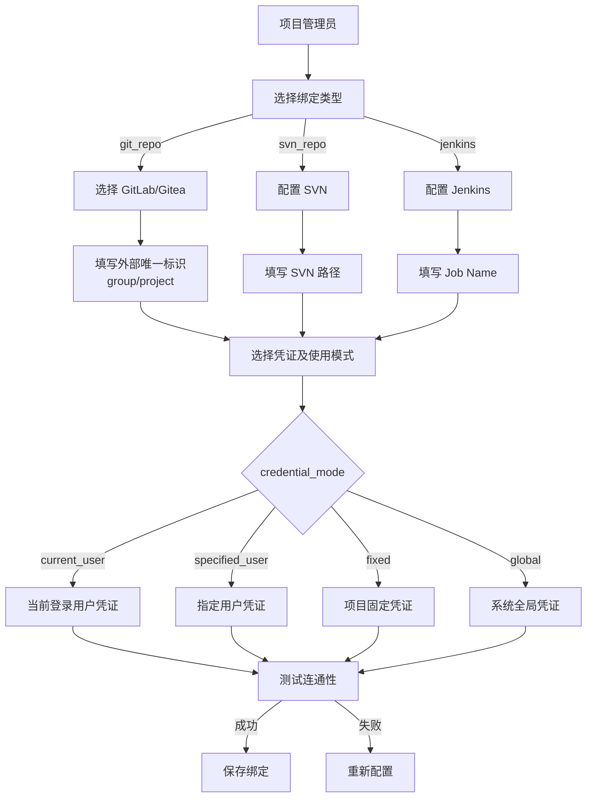
```mermaid
flowchart TD
    A[项目管理员] --> B[选择绑定类型]
    B -->|git_repo| C[选择 GitLab/Gitea]
    B -->|svn_repo| D[配置 SVN]
    B -->|jenkins| E[配置 Jenkins]
    C --> F[填写外部唯一标识<br/>group/project]
    D --> G[填写 SVN 路径]
    E --> H[填写 Job Name]
    F --> I[选择凭证及使用模式]
    G --> I
    H --> I
    I --> J{credential_mode}
    J -->|current_user| K[当前登录用户凭证]
    J -->|specified_user| L[指定用户凭证]
    J -->|fixed| M[项目固定凭证]
    J -->|global| N[系统全局凭证]
    K --> O[测试连通性]
    L --> O
    M --> O
    N --> O
    O -->|成功| P[保存绑定]
    O -->|失败| Q[重新配置]
```

---

### 3.5 代码仓库接入与 Commit 审查流程（已实现）

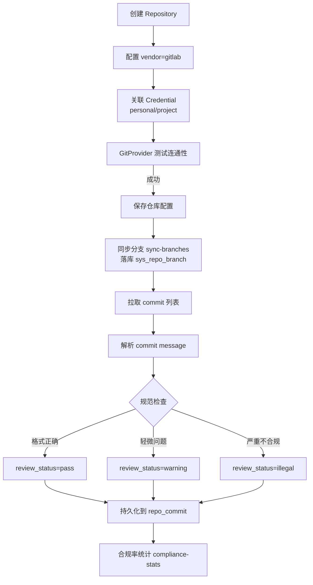
```mermaid
flowchart TD
    A[创建 Repository] --> B[配置 vendor=gitlab]
    B --> E[关联 Credential<br/>personal/project]
    E --> F[GitProvider 测试连通性]
    F -->|成功| G[保存仓库配置]
    G --> G2[同步分支 sync-branches<br/>落库 sys_repo_branch]
    G2 --> H[拉取 commit 列表]
    H --> I[解析 commit message]
    I --> J{规范检查}
    J -->|格式正确| K[review_status=pass]
    J -->|轻微问题| L[review_status=warning]
    J -->|严重不合规| M[review_status=illegal]
    K --> O[持久化到 repo_commit]
    L --> O
    M --> O
    O --> P[合规率统计 compliance-stats]
```

> 说明：
> - 当前仅支持 GitLab 代码仓库（已实现）；Gitea/SVN 仓库接入（规划中，未实现）。
> - 「AI 辅助审查」为规划中能力，后端未实现；AI 生成规范 commit 信息由 vscode-commit 插件承担。

**Commit 规范要求：**

```text
变更类型：
□ 无配置项改动 □有配置项改动

更新内容：
[A为功能增加 F为BUG修复]：
1. A xxx
2. F xxx

配置项改动[详见相关软件配置文件管理]：
[System]
DeviceType=0

关联性改动[选填]：
PXX板卡硬件版本:
...
```

---

### 3.6 TAG 生成与发布流程（已实现，以当前代码为准）

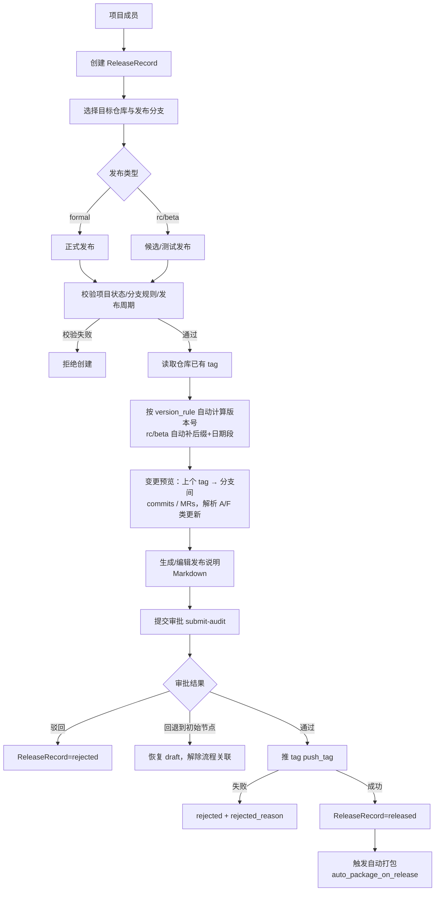
```mermaid
flowchart TD
    A[项目成员] --> B[创建 ReleaseRecord]
    B --> C[选择目标仓库与发布分支]
    C --> D{发布类型}
    D -->|formal| E[正式发布]
    D -->|rc/beta| F[候选/测试发布]
    E --> G[校验项目状态/分支规则/发布周期]
    F --> G
    G -->|校验失败| H[拒绝创建]
    G -->|通过| I[读取仓库已有 tag]
    I --> J[按 version_rule 自动计算版本号<br/>rc/beta 自动补后缀+日期段]
    J --> K[变更预览：上个 tag → 分支间<br/>commits / MRs，解析 A/F 类更新]
    K --> L[生成/编辑发布说明<br/>Markdown]
    L --> M[提交审批 submit-audit]
    M --> N{审批结果}
    N -->|驳回| O[ReleaseRecord=rejected]
    N -->|回退到初始节点| P[恢复 draft，解除流程关联]
    N -->|通过| Q[推 tag push_tag]
    Q -->|失败| R[rejected + rejected_reason]
    Q -->|成功| S[ReleaseRecord=released]
    S --> T[触发自动打包<br/>auto_package_on_release]
```

**发布校验规则（以代码为准）：**

| 规则 | 说明 | 状态 |
|-----|------|------|
| 发布类型 | `formal` / `rc` / `beta`（取代旧 formal/test） | 已实现 |
| 分支与 tag 后缀规则 | 由项目 `release_rule` / `version_rule` 控制 | 已实现 |
| 正式发布周期 | `validate_release_cycle` 按 `release_rule` 校验发布周期 | 已实现 |
| 提交审批前置 | 发布须处于 `draft` 且发布说明非空 | 已实现 |
| 打包与发布解耦 | 推 tag 成功后触发自动打包；打包失败不影响发布状态 | 已实现 |

> 说明：原规划中“审批通过 → 触发 Jenkins 构建 → 构建成功才推 tag、构建失败阻断发布”的
> 强耦合流程已废弃；当前为“审批通过 → 推 tag → 自动触发打包”，打包结果与发布状态解耦。

---

### 3.7 打包流程（已实现，apps.package；原 Jenkins 方案已废弃）

```mermaid
flowchart TD
    A[项目管理员] --> B[选择打包镜像]
    B -->|本地| C[本地 Docker 镜像<br/>支持 tar 导入 docker load]
    B -->|Nexus| D[Nexus 镜像<br/>nexus_* 系统配置]
    C --> E[保存 PackageConfig]
    D --> E
    E --> F[配置构建/产物目录<br/>环境变量/自定义脚本]
    F --> G[可选：SVN 推送配置<br/>auto_package_on_release]
    G --> H{触发方式}
    H -->|手动| I[configs/{id}/trigger]
    H -->|发布后自动| J[trigger_auto_packages_for_release]
    I --> K[创建 PackageTask queued]
    J --> K
    K --> L[Celery 异步执行]
    L --> M[准备 workspace<br/>source/artifacts/tmp]
    M --> N[git clone 源码]
    N --> O[启动容器 --entrypoint /bin/sh<br/>挂载 /workspace 三目录]
    O --> P{脚本来源}
    P -->|custom_script| Q[sh -ec 执行自定义脚本（遇错即停）]
    P -->|默认| R[执行镜像内置 script_entry<br/>/workspace/scripts/pack.sh]
    Q --> S[扫描 workspace/artifacts 产物]
    R --> S
    S --> T{SVN 推送?}
    T -->|是| U[推送产物到 SVN<br/>记录推送结果]
    T -->|否| V[任务 success]
    U --> V
    O -->|失败| W[任务 failure<br/>记录 error_message]
```

> 说明：原“Jenkins 自动打包流程”（build_job + Celery 轮询构建状态）为规划中方案，未实现且已废弃；
> Jenkins 模块已整体下线（仅保留迁移 tombstone）。打包任务状态为
> `queued / running / success / failure / canceled`，支持取消、查看日志、下载产物、事后手动 push-svn。

---

### 3.8 工作流审批流程（已实现）

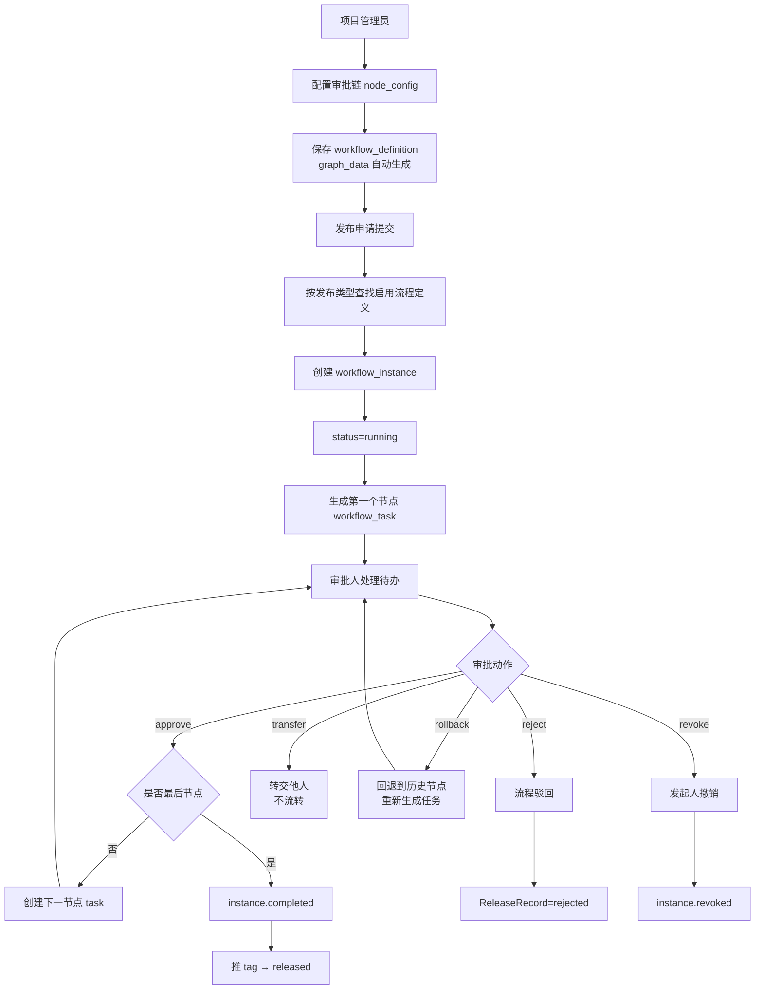
```mermaid
flowchart TD
    A[项目管理员] --> B[配置审批链 node_config]
    B --> C[保存 workflow_definition<br/>graph_data 自动生成]
    C --> D[发布申请提交]
    D --> E[按发布类型查找启用流程定义]
    E --> F[创建 workflow_instance]
    F --> G[status=running]
    G --> H[生成第一个节点 workflow_task]
    H --> I[审批人处理待办]
    I --> J{审批动作}
    J -->|approve| K{是否最后节点}
    J -->|reject| L[流程驳回]
    J -->|transfer| M[转交他人<br/>不流转]
    J -->|rollback| RB[回退到历史节点<br/>重新生成任务]
    J -->|revoke| N[发起人撤销]
    K -->|否| O[创建下一节点 task]
    K -->|是| P[instance.completed]
    O --> I
    RB --> I
    L --> Q[ReleaseRecord=rejected]
    P --> S[推 tag → released]
    N --> R[instance.revoked]
```

**审批模式与节点配置（以代码为准）：**

| 配置项 | 说明 |
|-------|------|
| mode=any（或签） | 任一审批人通过即流转 |
| mode=all（会签） | 全部审批人通过才流转 |
| 审批人类型 | leader（项目负责人）/ role（项目角色）/ user（指定用户）/ self（发起人） |
| 串行审批 | 审批链按 node_config 顺序逐节点流转 |
| 回退 | rollback 回退到历史节点；回退到初始节点时发布可恢复 draft |

> 说明：原规划中的 start/approval/cc/condition/end 节点类型与 LogicFlow 手工绘图未完全落地；
> 当前为 node_config 审批链 + 自动生成只读流程图，抄送节点、条件分支（规划中，未实现）。

---

### 3.9 发布看板与检索流程（已实现）

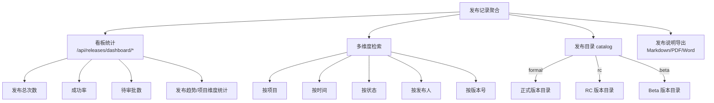
```mermaid
flowchart TD
    A[发布记录聚合] --> B[看板统计<br/>/api/releases/dashboard/*]
    B --> C[发布总次数]
    B --> D[成功率]
    B --> E[待审批数]
    B --> E2[发布趋势/项目维度统计]
    A --> G[多维度检索]
    G --> H[按项目]
    G --> I[按时间]
    G --> J[按状态]
    G --> K[按发布人]
    G --> L[按版本号]
    A --> M[发布目录 catalog]
    M -->|formal| N[正式版本目录]
    M -->|rc| O[RC 版本目录]
    M -->|beta| P[Beta 版本目录]
    A --> Q[发布说明导出<br/>Markdown/PDF/Word]
```

---

## 四、关键外部系统集成流程

### 4.1 LDAP/AD 集成

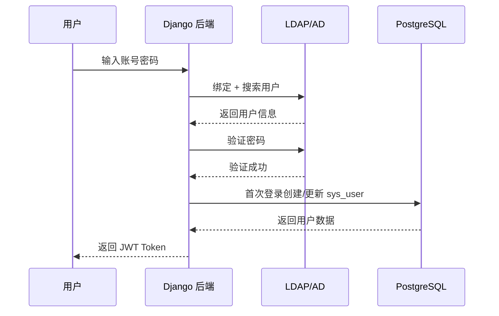
```mermaid
sequenceDiagram
    participant U as 用户
    participant S as Django 后端
    participant L as LDAP/AD
    participant DB as PostgreSQL

    U->>S: 输入账号密码
    S->>L: 绑定 + 搜索用户
    L-->>S: 返回用户信息
    S->>L: 验证密码
    L-->>S: 验证成功
    S->>DB: 首次登录创建/更新 sys_user
    DB-->>S: 返回用户数据
    S-->>U: 返回 JWT Token
```

### 4.2 Git 平台集成（已实现，当前仅 GitLab）

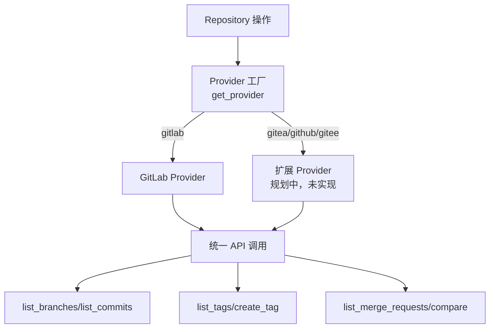
```mermaid
flowchart TD
    A[Repository 操作] --> B[Provider 工厂<br/>get_provider]
    B -->|gitlab| C[GitLab Provider]
    B -->|gitea/github/gitee| D[扩展 Provider<br/>规划中，未实现]
    C --> F[统一 API 调用]
    D --> F
    F --> G[list_branches/list_commits]
    F --> H[list_tags/create_tag]
    F --> I[list_merge_requests/compare]
```

### 4.3 打包运行环境集成（已实现，替代原 Jenkins 方案）

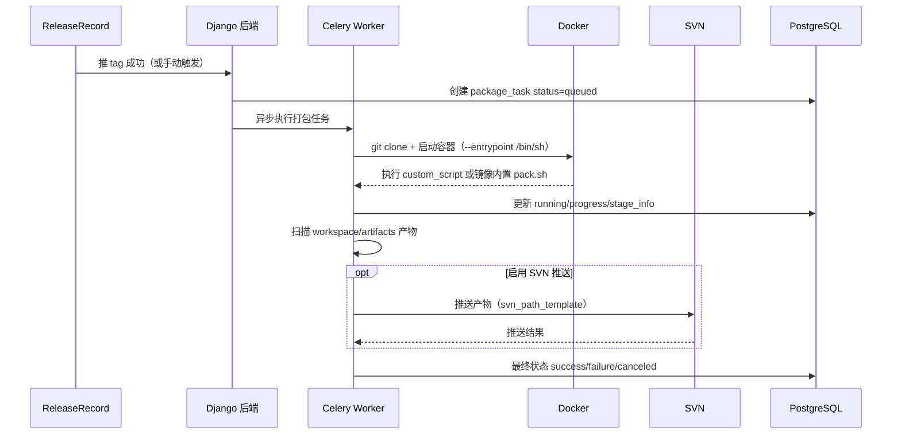
```mermaid
sequenceDiagram
    participant R as ReleaseRecord
    participant S as Django 后端
    participant C as Celery Worker
    participant D as Docker
    participant V as SVN
    participant DB as PostgreSQL

    R->>S: 推 tag 成功（或手动触发）
    S->>DB: 创建 package_task status=queued
    S->>C: 异步执行打包任务
    C->>D: git clone + 启动容器（--entrypoint /bin/sh）
    D-->>C: 执行 custom_script 或镜像内置 pack.sh
    C->>DB: 更新 running/progress/stage_info
    C->>C: 扫描 workspace/artifacts 产物
    opt 启用 SVN 推送
        C->>V: 推送产物（svn_path_template）
        V-->>C: 推送结果
    end
    C->>DB: 最终状态 success/failure/canceled
```

> Nexus 镜像源通过 `sys_config` 的 `nexus_base_url / nexus_username / nexus_password / nexus_registry_host`
> 配置（页面优先，环境变量兜底）；本地镜像支持 tar 包导入。
> 原 Jenkins 集成（build_job + 状态轮询）为规划中方案，未实现且已废弃。

### 4.4 AI 服务集成（规划中，后端未实现）

> 后端暂无 AI 调用模块与 `ai_invoke_log` 表；commit 规范审查基于规则引擎。
> 当前 AI 能力由 `vscode-commit/` VS Code 规范提交助手插件承担：默认本地 DeepSeek 接口，
> `commit.apiProtocol` 配置（auto / openai / anthropic）兼容 OpenAI / Anthropic 等更多 AI 服务。
> 后端 AI 场景（commit 日志生成、发布说明生成、风险识别、统一 AI Client 与调用日志）均为规划中，未实现。

---

## 五、核心状态机

### 5.1 发布记录状态机（已实现，以代码为准）

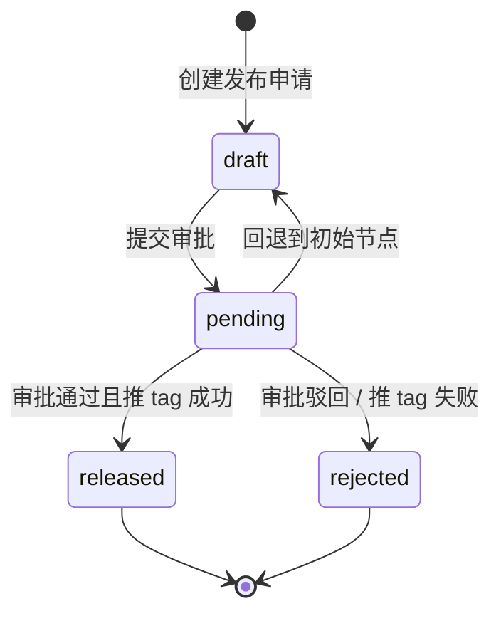
```mermaid
stateDiagram-v2
    [*] --> draft: 创建发布申请
    draft --> pending: 提交审批
    pending --> released: 审批通过且推 tag 成功
    pending --> rejected: 审批驳回 / 推 tag 失败
    pending --> draft: 回退到初始节点
    released --> [*]
    rejected --> [*]
```

> 旧的 `building / auditing` 状态已废弃：打包与发布状态解耦，
> 推 tag 成功后触发自动打包，打包结果由 `package_task` 独立跟踪。

### 5.2 审批任务状态机（已实现）

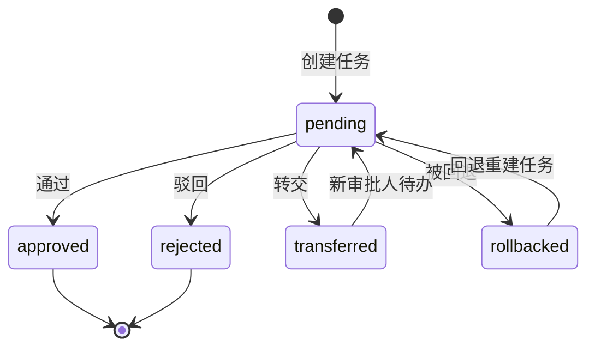
```mermaid
stateDiagram-v2
    [*] --> pending: 创建任务
    pending --> approved: 通过
    pending --> rejected: 驳回
    pending --> transferred: 转交
    pending --> rollbacked: 被回退
    approved --> [*]
    rejected --> [*]
    transferred --> pending: 新审批人待办
    rollbacked --> pending: 回退重建任务
```

### 5.3 打包任务状态机（已实现，替代原 Jenkins 构建状态机）

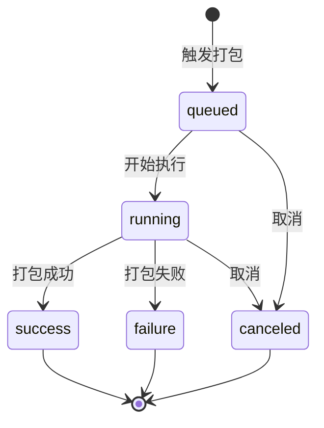
```mermaid
stateDiagram-v2
    [*] --> queued: 触发打包
    queued --> running: 开始执行
    queued --> canceled: 取消
    running --> success: 打包成功
    running --> failure: 打包失败
    running --> canceled: 取消
    success --> [*]
    failure --> [*]
    canceled --> [*]
```

### 5.4 Commit 审查状态机（已实现）

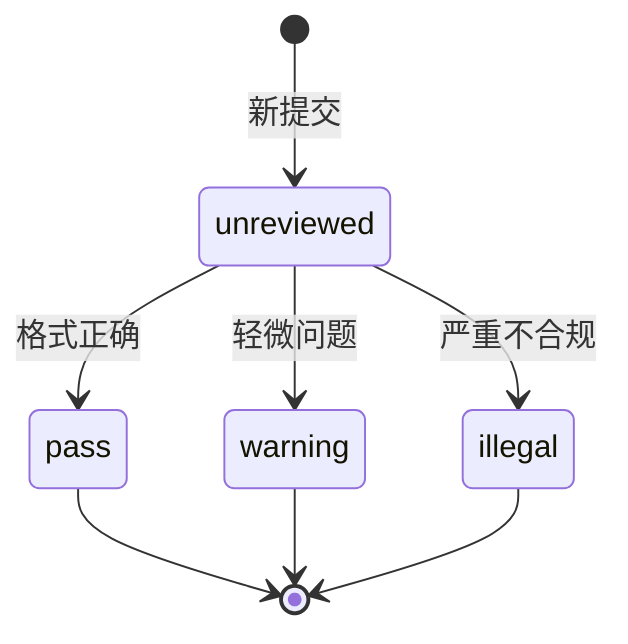
```mermaid
stateDiagram-v2
    [*] --> unreviewed: 新提交
    unreviewed --> pass: 格式正确
    unreviewed --> warning: 轻微问题
    unreviewed --> illegal: 严重不合规
    pass --> [*]
    warning --> [*]
    illegal --> [*]
```

---

## 六、关键业务规则汇总

| 规则编号 | 规则内容 | 状态 |
|---------|---------|------|
| R-001 | 发布分支规则由项目 `release_rule` 控制（发布类型 formal/rc/beta） | 已实现 |
| R-002 | rc/beta 版本自动补 tag 后缀并统一拼接日期段 | 已实现 |
| R-003 | 正式发布需满足发布周期规则（`validate_release_cycle`，周期值由 release_rule 配置） | 已实现 |
| R-004 | 测试版本不允许放入正式发布目录（发布目录按 formal/rc/beta 分类） | 已实现 |
| R-005 | ~~Jenkins 构建失败阻断后续发布步骤~~ 打包与发布解耦，打包失败不影响发布状态（原规则已废弃） | 已变更 |
| R-006 | ~~推 tag 前必须完成审批流且构建成功~~ 推 tag 前必须完成审批流（无构建前置） | 已变更 |
| R-007 | 项目停用后禁止新增发布 | 已实现 |
| R-008 | 凭证删除前必须校验是否被引用 | 已实现 |
| R-009 | 所有外部凭证必须加密存储，禁止明文落库 | 已实现 |
| R-010 | 项目数据严格按项目隔离 | 已实现 |
| R-011 | 超管拥有全部数据与功能权限 | 已实现 |
| R-012 | 操作日志必须记录登录、登出、关键业务操作 | 已实现 |
| R-013 | 反馈删除仅限本人或超管；仅超管可标记反馈为已处理 | 已实现 |

---

## 七、API 与数据流总览

主要接口清单（详见 [docs/后台设计.md 6.2 节](./后台设计.md)）：

- `/api/auth/*`：认证（登录/刷新/登出/用户信息/菜单）
- `/api/account/*`：用户/角色/权限
- `/api/projects/*`：项目/成员（外站绑定接口已废弃）
- `/api/credentials/*`：凭证管理（类型/测试/使用记录）
- `/api/repositories/*`：仓库管理（分支同步/合规率统计/变更预览）
- `/api/commits/*`：提交审查
- `/api/releases/*`：发布管理（含 dashboard/* 看板统计、catalog 发布目录、导出）
- `/api/packages/*`：打包（镜像/配置/任务，替代原 `/api/jenkins/*`，已下线）
- `/api/workflow/*`：工作流（通过/驳回/转交/回退/撤销）
- `/api/notifications/*`：站内通知
- `/api/feedback/*`：使用反馈
- `/api/system/*`：系统管理（配置/操作日志/LDAP 连接测试）
- `/api/schema/`、`/swagger/`、`/redoc/`：API 文档
- `/health/`：健康检查（含 db/redis 状态）

> 说明：原独立 `/api/dashboard/*` 未落地，看板统计挂在 `/api/releases/dashboard/*` 下；
> `/api/system/ai-logs/` 未实现（后端无 AI 调用日志）。

---
